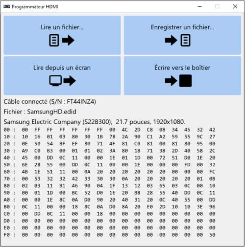

# HDMIProgram

Ce logiciel est destiné à programmer le pare-feu HDMI décrit dans l'article [Un pare-feu pour le HDMI](https://www.sstic.org/2021/presentation/un_pare_feu_pour_le_hdmi/) présenté au SSTIC en 2021.

Pour fonctionner, il nécessite impérativement un câble USB permettant de communiquer en I2C avec un port HDMI. Ce câble est assemblé à partir de deux demi câbles : un [FTDI C232HM-EDHSL-0](https://ftdichip.com/products/c232hm-edhsl-0/) et un demi câble HDMI (coupé en deux).
Le plan de câblage est le suivant :

## Compilation

Utiliser CMake pour générer le projet (CMake va automatiquement télécharger les dépendances : glfw, imgui et nativefiledialog), puis utiliser Visual Studio pour le compiler.

L'exécutable généré n'utilise pas de fichiers externes et peut être distribué sans nécessiter un programme d'installation (attention cependant aux redistribuables de Visual Studio qui peuvent manquer sur des machines fraîchement installées).

## Utilisation

Les quatre grands boutons en partie supérieure permettent :

- De lire un fichier d’EDID préalablement sauvegardé sur le disque ;
- D’enregistrer le fichier d’EDID couramment chargé vers un fichier sur le disque ;
- De lire l’EDID d’un écran (le câble de programmation doit y être branché préalablement) ;
- D’écrire l’EDID couramment chargé dans le boitier du pare-feu (qui doit être branché via son port ORDINATEUR au câble de programmation).

Si aucun câble de programmation n’a été détecté au démarrage du logiciel, il est possible de relancer la recherche en cliquant sur le bouton « Rechercher un câble », qui apparait dans cette circonstance.

Lorsqu’une EDID est chargée (par la lecture d’un écran à l’aide du câble, ou par la lecture d’un fichier), sa validité est contrôlée et son contenu est affiché dans la partie inférieure. Une description succincte de l’écran concerné est également affichée, qui se base sur le contenu de l’EDID (nom du fabricant, nom du modèle, taille de la diagonale en pouces et résolution native).

